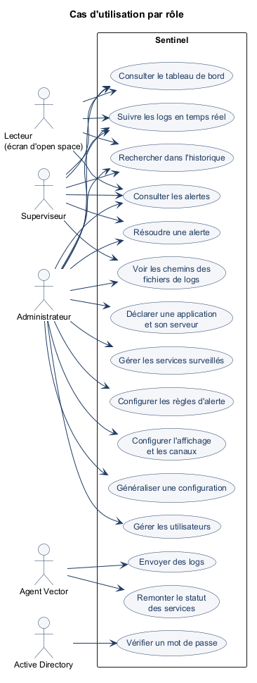
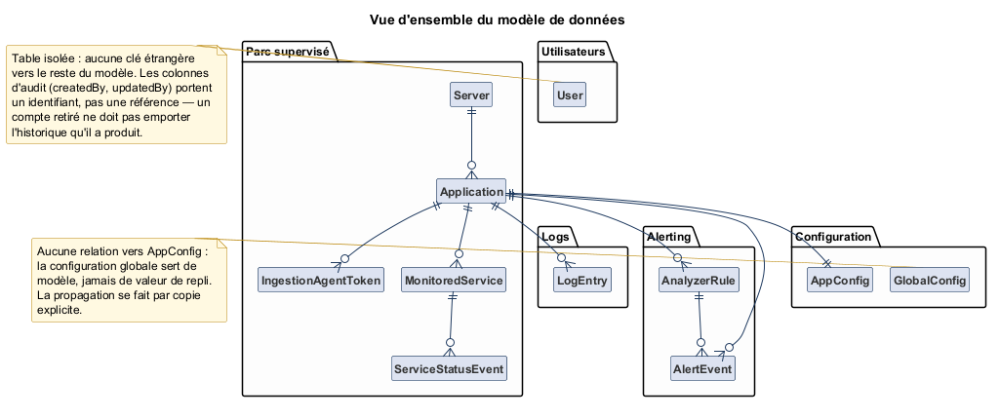
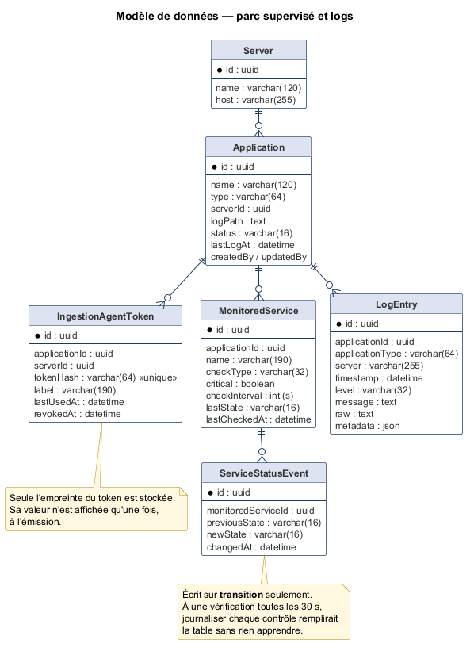
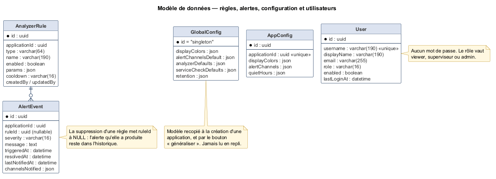
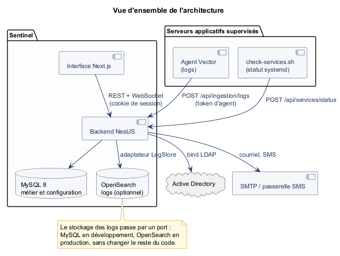
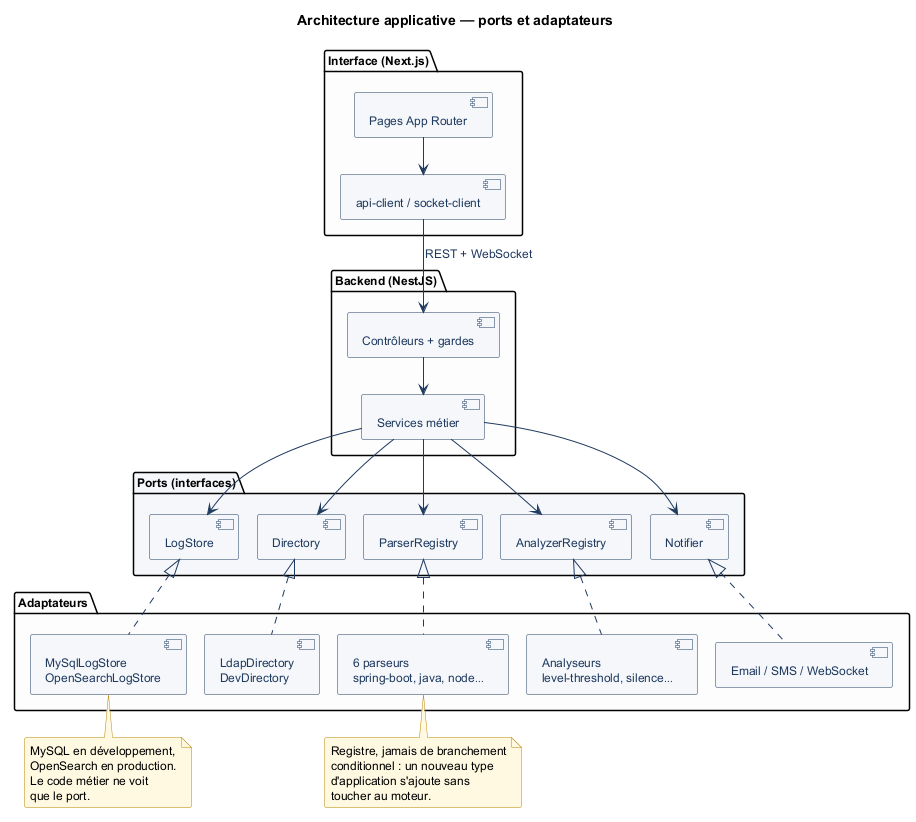
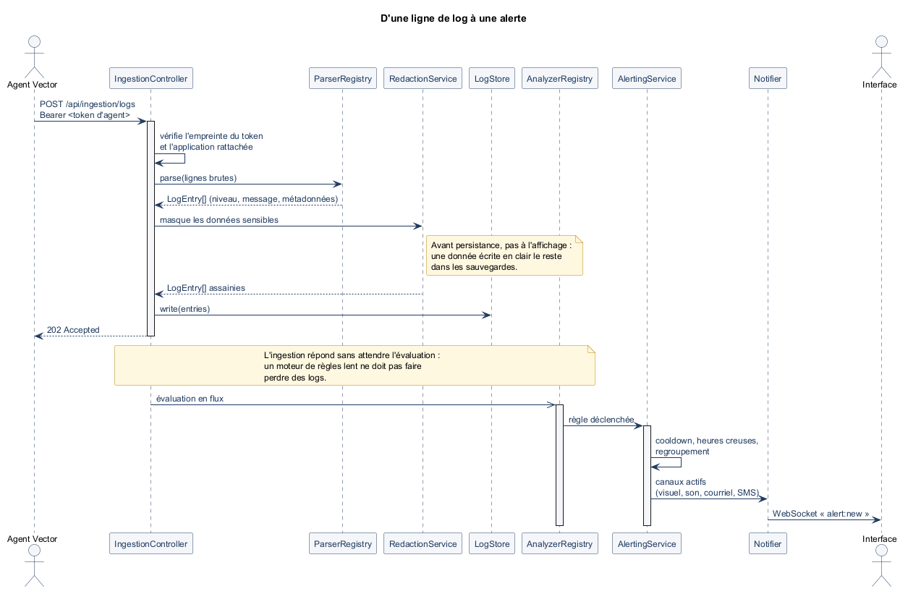
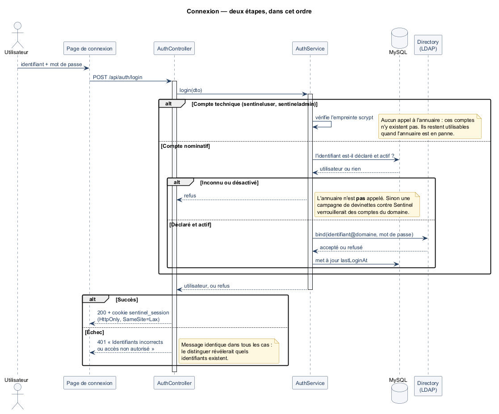
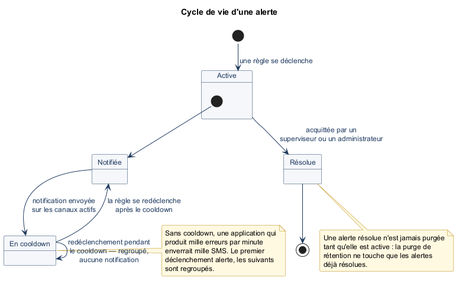

# Objet et périmètre du document

Ce document présente l'analyse et la conception de **Sentinel**, application de supervision des
logs et de l'état des services du parc applicatif monétique du GIE GCB. Il décrit les acteurs et
leurs droits, les règles de gestion structurantes, le modèle de données et les choix techniques
retenus.

Il documente l'état **réellement implémenté**, ainsi que les décisions prises en cours de
réalisation et leur justification. Lorsqu'un choix s'écarte de ce qui était initialement prévu,
l'écart est signalé et motivé ; le journal complet de ces arbitrages se trouve dans
`docs/DECISIONS.md`.

Sont hors périmètre de cette version : la double authentification (TOTP), l'édition en place de
certaines entités de référence, et l'exploitation d'une instance OpenSearch réelle — l'adaptateur
correspondant est écrit mais n'a jamais été exercé faute d'environnement.

# Contexte métier

La monétique du GIE GCB repose sur une dizaine d'applications hétérogènes, réparties sur onze
serveurs : des services Spring Boot, des applications Java simples, un backend Node sous PM2, des
frontaux React servis par Nginx, et un composant maison au format de log spécifique.

Ces applications ne partagent ni technologie, ni format de log, ni convention de nommage de
fichier. Elles ont en revanche un point commun : lorsqu'elles se dégradent, personne ne l'apprend
avant qu'un utilisateur ne le signale. La détection repose sur une connexion manuelle au serveur
concerné et une lecture de fichier — ce qui suppose de savoir *où* regarder, et *quand*.

L'application vise trois objectifs :

- **centraliser** les logs de toutes les applications du parc, quel que soit leur format, et les
  rendre consultables en temps réel comme dans l'historique ;
- **détecter automatiquement** les dégradations selon des règles paramétrables par application,
  sans attendre un signalement ;
- **alerter** de façon proportionnée — visuelle et sonore sur l'écran de l'open space, par courriel
  et SMS pour ce qui ne peut pas attendre.

Un quatrième besoin est apparu à l'usage : savoir qu'un service `systemd` est tombé, ce qu'aucune
ligne de log ne dit — un service arrêté n'écrit rien. La supervision de l'état des services est
donc traitée comme un flux distinct de celui des logs.

# Analyse fonctionnelle

## Acteurs et rôles

Trois rôles applicatifs sont définis : `viewer` (lecteur), `superviseur` et `admin`. Contrairement
à d'autres modèles, ils ne sont **pas cumulables** : un compte porte un rôle et un seul.

{width=11cm}

| Rôle | Ce qu'il apporte |
|:---|:---|
| `viewer` | Consultation seule : tableau de bord, logs en temps réel, historique, alertes. |
| `superviseur` | Le lecteur, **plus** le droit de résoudre une alerte et de voir les chemins des fichiers de logs. |
| `admin` | Le superviseur, **plus** l'administration : applications, serveurs, services, règles, configuration, utilisateurs. |

Deux acteurs système complètent le tableau : l'**agent Vector** installé sur chaque serveur
applicatif, qui pousse les logs et l'état des services, et l'**Active Directory**, qui valide les
mots de passe sans jamais déterminer les droits applicatifs.

Une décision mérite d'être soulignée : bien que les droits de ces trois rôles se trouvent
aujourd'hui emboîtés, la conception **ne repose sur aucune hiérarchie**. Chaque droit est déclaré
explicitement, rôle par rôle, dans une table unique (`ROLE_PERMISSIONS`). Une hiérarchie implicite
« admin ⊃ superviseur ⊃ viewer » aurait été plus courte à écrire, mais elle rend inexprimable le
premier droit qui ne suivrait pas l'ordre attendu — et c'est précisément le genre de droit qui
finit par apparaître.

## Cas d'utilisation principaux

| Acteur | Cas d'utilisation |
|:---|:---|
| Lecteur | Consulter le tableau de bord ; suivre les logs en temps réel ; rechercher dans l'historique ; consulter les alertes |
| Superviseur | Les cas du lecteur ; résoudre une alerte ; voir les chemins des fichiers de logs |
| Administrateur | Les cas du superviseur ; déclarer une application et son serveur ; gérer les services surveillés ; configurer les règles d'alerte ; configurer l'affichage et les canaux ; généraliser une configuration ; gérer les utilisateurs |
| Agent Vector | Envoyer des logs ; remonter l'état des services |
| Active Directory | Vérifier un mot de passe |

## Règles de gestion structurantes

### Le parsing est un point d'extension, jamais un branchement

Chaque type d'application a son format de log. Traiter cette variabilité par des conditions
dispersées dans le code métier (`if (type === 'spring-boot') …`) aurait rendu l'ajout d'un
onzième type impossible sans relire l'ensemble.

Le parsing passe donc par une interface et un **registre** : six parseurs sont enregistrés
(`spring-boot`, `java-simple`, `distribcard`, `nodejs-pm2`, `react-nginx`, plus un parseur
générique de repli). Ajouter un type consiste à écrire un parseur et à l'enregistrer ; aucun code
existant n'est modifié.

Le parseur générique n'est pas un pis-aller : il garantit qu'une application dont le format n'est
pas encore reconnu remonte tout de même ses lignes, avec un niveau déduit au mieux. Mieux vaut une
supervision approximative qu'une application invisible.

### Configuration globale et configuration par application : deux entités, jamais un repli

La configuration d'affichage (couleurs par niveau de log) et les canaux d'alerte existent à deux
échelles : une configuration globale, et une configuration par application.

La relation entre les deux est une **copie explicite**, jamais une lecture en cascade. À la
création d'une application, sa configuration est recopiée depuis la configuration globale ; le
bouton « généraliser » recopie à nouveau, vers les applications choisies.

L'alternative — lire la valeur de l'application, et se rabattre sur la globale si elle est absente
— paraissait plus économe. Elle a été écartée : elle rend impossible de distinguer « cette
application utilise volontairement la couleur par défaut » de « cette application n'a pas été
configurée », et fait changer l'affichage d'applications qu'on ne touchait pas lorsqu'on modifie
le réglage global.

### Détection du silence

Une application qui cesse d'émettre ne produit aucune erreur : elle disparaît, simplement. Sans
traitement particulier, son tableau de bord resterait vert.

Deux règles couvrent ce cas, créées automatiquement et non pas laissées à l'initiative de
l'administrateur :

- `silence` — aucun log reçu depuis un délai donné ;
- `service-silence` — aucune vérification d'état reçue pour un service surveillé.

La seconde va de pair avec `service-status` : déclarer un service à surveiller crée
**immédiatement** ses deux règles. Sans `service-silence`, un agent qui cesse d'envoyer ses
vérifications laisserait le service affiché dans son dernier état connu — vert, très probablement
— alors que plus personne ne le surveille.

### État agrégé d'une application

Le badge d'une application vaut `critique` dès qu'une alerte critique est active **ou** qu'un
service déclaré **critique** est tombé ; `warning` s'il n'existe que des alertes de moindre
gravité ; `ok` sinon.

La nuance porte sur le caractère critique du service : un service non critique qui tombe alerte
bien, mais ne fait pas basculer le badge de l'application. Sans cette distinction, un service
accessoire aurait fait passer au rouge une application par ailleurs parfaitement saine — et le
rouge aurait cessé d'être lu.

### Anti-spam : le premier déclenchement alerte, les suivants sont regroupés

Une application qui produit mille erreurs par minute enverrait mille SMS. Chaque règle porte donc
un **cooldown** : après une notification, les redéclenchements sont regroupés jusqu'à expiration
du délai.

S'y ajoutent les **heures creuses**, configurables par application : une plage horaire pendant
laquelle certains canaux sont suspendus. Une alerte survenue à trois heures du matin reste
enregistrée et visible — elle n'est simplement pas envoyée par SMS.

Une alerte résolue est diffusée sans son ni SMS : rassurer ne doit pas coûter une seconde
interruption.

### Masquage des données sensibles, avant persistance

Les logs d'une production monétique peuvent contenir des numéros de carte. Ils sont masqués
**avant écriture**, et non à l'affichage.

Ce n'est pas un détail d'implémentation : une donnée écrite en clair le reste dans les
sauvegardes, dans les réplicas, et dans tout export ultérieur. Masquer à l'affichage aurait donné
l'apparence de la conformité sans la protection.

### Rétention : purger sans effacer ce qui alerte

Les logs sont volumineux et perdent vite leur intérêt ; les alertes résolues sont peu volumineuses
et servent au bilan annuel. Les durées de conservation sont donc distinctes et configurables.

La purge ne supprime jamais une alerte **active**, quel que soit son âge. Une alerte ouverte depuis
quatre-cents jours signale un problème que personne n'a traité : c'est précisément celle qu'il ne
faut pas faire disparaître.

# Modèle de données

## Vue d'ensemble

Le schéma s'organise en cinq ensembles : le **parc supervisé**, les **logs**, l'**alerting**, la
**configuration** et les **utilisateurs**.

{width=16cm}

## Parc supervisé et logs

{width=16cm}

Une `Application` est rattachée à un `Server` et porte le chemin du fichier de logs suivi. La
relation vers le serveur est en `Restrict` : supprimer un serveur qui héberge encore des
applications est refusé, plutôt que de les emporter silencieusement.

`IngestionAgentToken` mérite une attention particulière. Le token est rattaché à
l'**application**, et pas seulement au serveur : plusieurs applications cohabitent sur une même
machine — filemanager et planning backoffice, par exemple — et un token compromis ne doit pas
permettre d'injecter des logs dans l'application voisine. Seule l'**empreinte** du token est
stockée ; sa valeur n'est affichée qu'une fois, à l'émission, et n'est plus jamais consultable.

`MonitoredService` porte l'état courant (`lastState`, `lastCheckedAt`), mis à jour à **chaque**
vérification — c'est ce qui permet de détecter un silence. `ServiceStatusEvent`, en revanche,
n'est écrit que sur **transition** : à une vérification toutes les trente secondes, journaliser
chaque contrôle remplirait la table sans rien apprendre.

## Alerting, configuration et utilisateurs

{width=16cm}

La relation entre `AnalyzerRule` et `AlertEvent` est en `SetNull` : supprimer une règle met
`ruleId` à `NULL` sur les alertes qu'elle a produites, mais ne les efface pas. L'historique de ce
qui s'est passé ne doit pas dépendre de la survie de la règle qui l'a détecté.

`GlobalConfig` est une ligne unique (`id = "singleton"`) et n'a **aucune relation** vers
`AppConfig` : c'est la traduction en base du principe de copie explicite énoncé plus haut.

La table `User` est isolée : aucune clé étrangère vers le reste du modèle. Les colonnes d'audit
(`createdBy`, `updatedBy`) portent un identifiant, pas une référence. Un compte retiré ne doit pas
emporter l'historique qu'il a produit.

**Aucun mot de passe n'est stocké**, sous aucune forme. La base conserve l'identité applicative, le
rôle, l'état d'activation et la date de dernière connexion.

# Conception technique

## Vue d'ensemble

{width=16cm}

Un agent Vector est installé sur chaque serveur applicatif : il suit le fichier de logs déclaré et
pousse les lignes vers le backend, en s'authentifiant par un token propre à l'application. Un
script compagnon remonte en parallèle l'état des services `systemd`. Le backend centralise, analyse
et diffuse ; l'interface consulte et affiche en temps réel.

## Architecture applicative

{width=16cm}

Le projet est un **monorepo** en espaces de travail npm, avec des références de projet TypeScript.
Les types partagés (`packages/shared-types`) sont consommés par le backend qui valide les requêtes
et par le frontend qui les émet : un contrat ne peut pas diverger entre les deux côtés sans que le
compilateur le signale.

Quatre points d'extension sont formalisés en **ports**, chacun avec ses adaptateurs :

| Port | Adaptateurs | Ce qu'il isole |
|:---|:---|:---|
| `LogStore` | MySQL, OpenSearch | Le stockage des logs, volumineux et de nature différente du reste |
| `Directory` | LDAP, annuaire de développement | La dépendance à l'Active Directory |
| `ParserRegistry` | 6 parseurs | La variabilité des formats de log |
| `AnalyzerRegistry` | 5 analyseurs | Les règles de détection |
| `Notifier` | courriel, SMS, WebSocket | Les canaux de notification |

Le port `LogStore` a une justification propre : MySQL convient au développement et aux volumes
initiaux, mais pas au parc complet à moyen terme. Le faire passer par un port dès le début permet
de basculer sur OpenSearch par une variable d'environnement, sans reprendre le code métier.

## Pile technique

| Domaine | Choix |
|:---|:---|
| Langage | TypeScript strict, sur l'ensemble du dépôt |
| Backend | NestJS 11, architecture modulaire |
| Persistance métier | Prisma 6, MySQL 8, migrations incrémentales |
| Stockage des logs | MySQL ou OpenSearch, derrière le port `LogStore` |
| Interface | Next.js 16 (App Router), React 19, Tailwind CSS |
| Temps réel | Socket.IO |
| Validation | Zod, schémas partagés backend/frontend |
| Agents de collecte | Vector, configuration déclarative TOML |
| Authentification | Active Directory (LDAP), sessions par cookie signé |
| Tests | Node test runner et Jest, plus des scénarios de bout en bout |

**Validation par Zod plutôt que `class-validator`.** Le choix n'est pas cosmétique : Zod permet de
déclarer le schéma **et** d'en dériver le type TypeScript, dans le paquet partagé. Le frontend
manipule donc exactement le type que le backend valide. Avec `class-validator`, la validation
serait restée côté backend et le frontend aurait travaillé sur une définition parallèle, à
maintenir en cohérence à la main.

**Pas de Docker en développement.** Le poste de développement ne dispose pas des droits
d'administration. MySQL est lancé en installation autonome sur un port dédié, piloté par un script
du dépôt. Ce n'est pas un renoncement à la conteneurisation en production, mais la reconnaissance
qu'un environnement de développement doit fonctionner sur la machine dont on dispose.

## Chaîne d'ingestion

{width=15cm}

Le point de conception le plus notable est que **l'ingestion n'attend pas l'évaluation des
règles**. L'agent reçoit sa réponse dès que les lignes sont écrites ; les analyseurs travaillent
ensuite. Un moteur de règles lent ou en erreur ne doit pas faire perdre des logs — l'inverse
reviendrait à perdre l'information au moment précis où elle compte.

La limitation de débit sur l'ingestion est comptée **par agent**, via l'empreinte du token
présenté, et non par adresse IP. Plusieurs applications partagent un même serveur : compter par IP
les aurait fait se brider mutuellement, jusqu'à faire perdre des logs à une application saine
parce qu'une voisine est bavarde.

## Sécurité

L'application supervise une production monétique et ses logs peuvent contenir des données de
porteurs. Chaque catégorie du **OWASP Top 10** est traduite en mesures concrètes dans
`docs/SECURITY.md`. Les points structurants :

### Authentification en deux temps, dans cet ordre

{width=15cm}

Se connecter demande **deux choses à la fois** : un compte Active Directory valide, et avoir été
déclaré utilisateur par un administrateur.

L'ordre des vérifications a fait l'objet d'un arbitrage explicite. Sentinel vérifie **d'abord** que
l'identifiant est déclaré et actif, et ne présente le mot de passe à l'annuaire qu'ensuite. Dans
l'ordre inverse, une campagne de devinettes contre Sentinel se serait transformée en tentatives de
connexion sur les comptes du domaine, avec le risque de les verrouiller : un déni de service sur
les comptes de l'entreprise, déclenché depuis une application de supervision.

Le message de refus est identique dans tous les cas — mot de passe faux, compte inconnu, compte
désactivé, compte absent de l'annuaire. Le nuancer révélerait quels identifiants existent.

Deux comptes techniques échappent à l'annuaire, définis par la configuration du serveur et absents
de la liste des utilisateurs : `sentineluser` (lecteur, pour l'écran de l'open space, session de
longue durée) et `sentineladmin` (super administrateur, filet de sécurité). Leurs mots de passe
sont **hachés** avec `scrypt`, jamais chiffrés : un chiffré supposerait une clé capable de le
déchiffrer, donc un secret de plus à protéger.

### Le contrôle d'accès descend jusqu'au champ

Un contrôle qui s'arrête à la route laisse passer des données que l'appelant n'a pas à voir dans
une réponse à laquelle il a pourtant droit.

Le cas concret : les chemins des fichiers de logs. Un lecteur a le droit de consulter la liste des
applications — c'est même son écran principal — mais pas de savoir que les logs de telle
application vivent dans `/home/mobileapi/API_MOBILE/LOG/`. Cette information décrit l'arborescence
d'une machine de production et oriente qui chercherait où frapper. Le grand écran de l'open space
se connecte précisément avec ce rôle, et il est visible de tout le plateau.

Le champ est donc retiré **de la réponse**, pas de l'affichage : le masquer côté interface
l'aurait laissé lisible dans l'onglet réseau du navigateur.

### Retirer l'accès : on désactive, on ne supprime pas

Il n'existe pas de suppression d'utilisateur. La suppression effacerait la trace de qui a eu accès
et quand — précisément ce qu'on veut pouvoir consulter après un incident — et rien ne la
distinguerait d'un clic malheureux. Un compte désactivé conserve son historique et se réactive.

### Autres mesures

Session dans un cookie `HttpOnly` / `SameSite=Lax`, hors de portée d'une XSS ; rôle et activation
**relus en base à chaque requête** plutôt que tirés du jeton, pour qu'un retrait de droits prenne
effet immédiatement ; échappement RFC 4515 des filtres LDAP ; limitation des tentatives de
connexion ; en-têtes de sécurité explicites ; et aucune divulgation de détail interne dans les
réponses d'erreur, remplacée par un identifiant de corrélation journalisé côté serveur.

## Cycle de vie d'une alerte

{width=14cm}

Une alerte naît du déclenchement d'une règle, notifie sur les canaux actifs, puis entre en
cooldown. Elle reste **active** jusqu'à ce qu'un superviseur ou un administrateur l'acquitte : il
n'y a pas de résolution automatique. Une alerte qui disparaîtrait d'elle-même laisserait croire que
le problème a été traité.

# Choix de conception notables

| Décision | Justification |
|:---|:---|
| Ingestion découplée de l'évaluation des règles | Un moteur de règles lent ne doit pas faire perdre des logs |
| Limitation de débit par agent, non par IP | Plusieurs applications partagent un serveur ; compter par IP les ferait se brider mutuellement |
| Token d'ingestion rattaché à l'application | Un token compromis ne peut pas injecter dans l'application voisine du même serveur |
| Stockage des logs derrière un port | Bascule MySQL → OpenSearch sans reprise du code métier |
| Parsing par registre, jamais par condition | Un onzième type d'application s'ajoute sans relire l'existant |
| Copie explicite de configuration, aucun repli | Distingue « valeur par défaut choisie » de « jamais configuré » ; modifier le global ne change pas les applications existantes |
| Règles de silence créées d'office | Une application muette resterait affichée verte |
| Badge piloté par les seuls services critiques | Un service accessoire ne doit pas faire passer au rouge une application saine |
| Masquage des données sensibles avant persistance | Une donnée écrite en clair le reste dans les sauvegardes |
| Purge épargnant les alertes actives | Une alerte ancienne et non résolue est celle qu'il ne faut surtout pas perdre |
| Vérification « utilisateur déclaré » avant l'annuaire | Évite de transformer une attaque sur Sentinel en verrouillage des comptes du domaine |
| Droits déclarés rôle par rôle, sans hiérarchie | Rend exprimable le premier droit qui ne suivra pas l'ordre attendu |
| Chemins de logs retirés de la réponse | Masquer à l'affichage seulement ne masque rien |
| Désactivation plutôt que suppression d'utilisateur | Conserve la trace des accès ; réversible |
| Validation Zod partagée | Un seul schéma pour valider côté serveur et typer côté client |
| Aucun mot de passe utilisateur stocké | L'annuaire fait autorité ; rien à protéger, rien à faire fuir |

# Qualité et vérification

La vérification s'appuie sur trois niveaux, choisis en fonction de ce que chacun peut réellement
détecter.

**Tests unitaires** — 119 tests couvrant en priorité ce qui est subtil et silencieux en cas
d'erreur : les six parseurs de logs, les analyseurs et leurs seuils, le calcul des heures creuses,
le masquage des données sensibles, le hachage `scrypt`, et l'échappement des filtres LDAP. Cette
dernière famille mérite d'exister : une recherche annuaire sur `*)(objectClass=*` ne doit pas se
transformer en énumération complète de l'annuaire.

**Scénarios de bout en bout** — un script déroule le parcours d'authentification complet contre un
backend démarré : 43 vérifications sur les trois rôles, la recherche annuaire, la désactivation, la
session d'affichage, la limitation des tentatives, et le fait que cette limitation ne se contourne
pas.

**Vérification dans un navigateur réel** — 33 contrôles sur les parcours de connexion, de
redirection et d'affichage différencié par rôle. Ce niveau n'est pas redondant avec les précédents :
plusieurs anomalies n'étaient visibles qu'en exécutant réellement l'interface, notamment sur les
politiques d'autoplay audio des navigateurs, qui diffèrent entre un élément `<audio>` et un
`AudioContext` et ne se déduisent d'aucune documentation.

Une porte d'audit de sécurité (`npm run audit:security`) refuse toute vulnérabilité haute ou
critique non motivée. Les exceptions restantes sont **datées et justifiées** : trois dépendances
transitives de l'outillage de migration, absentes du runtime déployé, à relever dès qu'un correctif
est publié.

# Limites connues et évolutions

- **Double authentification (TOTP)** : conçue, non implémentée. Le modèle et le parcours sont
  décrits dans `docs/AUTH.md`. Les deux comptes techniques en resteront exclus — l'écran mural n'a
  personne pour saisir un code, et le compte de secours doit fonctionner quand tout le reste est
  cassé.
- **Adaptateur OpenSearch** : écrit, jamais exercé faute d'instance disponible. Le port est en
  place et le basculement se fait par variable d'environnement, mais la bascule devra être validée
  sur un environnement réel avant mise en production.
- **Déploiement Docker** : les fichiers de composition existent et n'ont pas été exécutés, le poste
  de développement ne disposant pas de Docker.
- **Alertes sonores et politiques navigateur** : le son fonctionne, mais dépend d'un réglage à faire
  une fois par poste sur les navigateurs Chromium. Le contournement est documenté dans
  `docs/FRONTEND.md`.
- **Édition en place de certaines entités** : les serveurs et les services surveillés se créent et
  se suppriment, mais ne se modifient pas. Simplification assumée, à lever si le besoin se confirme.
