# À qui s'adresse ce guide

**Sentinel** centralise les logs et l'état des services des applications monétiques du GIE GCB,
détecte les anomalies et alerte avant qu'un utilisateur ne signale un problème.

Ce guide couvre les trois profils d'utilisateur. Chacun peut se limiter à la partie qui le
concerne :

| Vous êtes | Lisez |
|:---|:---|
| Toute personne qui consulte | « Se connecter », « Le tableau de bord », « Suivre une application », « Les alertes » |
| Exploitant, superviseur | Les mêmes chapitres, plus « Résoudre une alerte » |
| Administrateur | L'ensemble, en particulier « Guide de l'administrateur » |

Les captures d'écran ont été prises sur un jeu de données de démonstration : les noms
d'applications et les valeurs affichées diffèrent de ce que vous verrez.

---

# Se connecter

## Ouvrir une session

Rendez-vous sur l'adresse de Sentinel communiquée par votre administrateur.

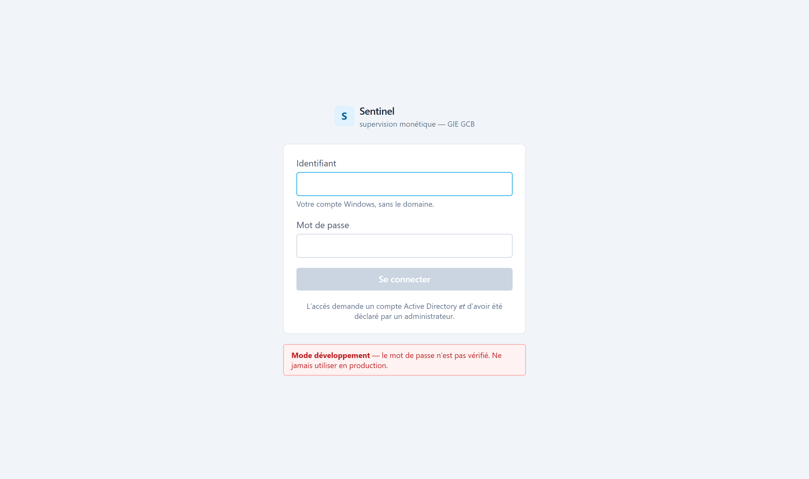{width=13cm}

Saisissez votre **compte Windows habituel**, sans le domaine — `jdupont`, et non
`jdupont@gie.local` ni `GIE\jdupont` — puis votre mot de passe Windows.

L'accès demande **deux choses à la fois** :

1. un compte Active Directory valide, c'est-à-dire votre compte Windows ;
2. avoir été déclaré utilisateur de Sentinel par un administrateur.

Les deux sont nécessaires. Si vous obtenez « Identifiants incorrects ou accès non autorisé » alors
que votre mot de passe Windows fonctionne ailleurs, c'est très probablement le second point qui
manque : demandez à un administrateur de vous déclarer.

> **Le message de refus est volontairement identique** dans tous les cas — mot de passe erroné,
> compte inconnu, compte désactivé. Le nuancer indiquerait à un tiers quels identifiants existent.
> Ce n'est pas un défaut d'ergonomie, c'est une protection.

Après cinq tentatives infructueuses en une minute, les suivantes sont refusées pendant un moment.
Attendez une minute plutôt que d'insister.

### Si un code vous est demandé

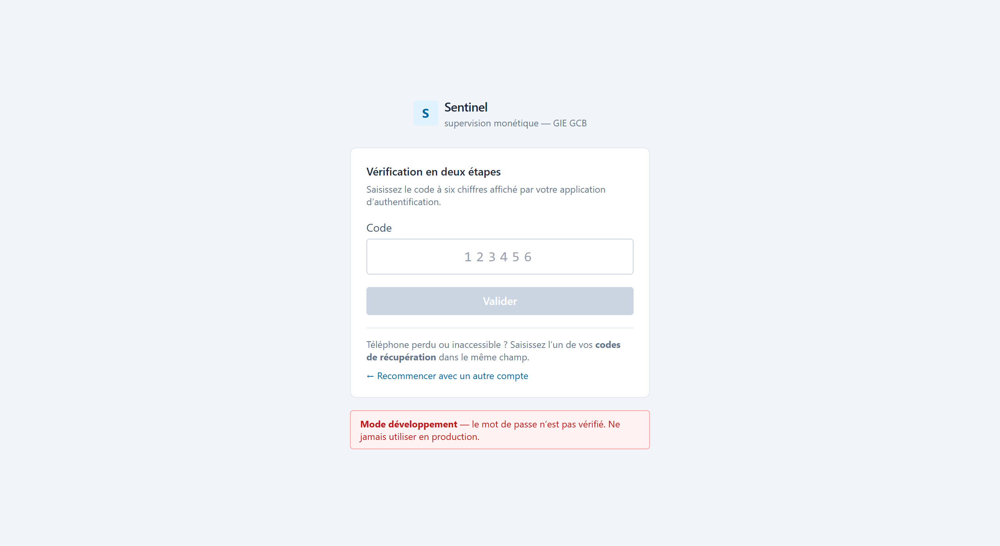{width=11cm}

Votre compte a la **double authentification** activée : saisissez le code à six chiffres affiché par
votre application d'authentification. Voir « Protéger son compte » plus bas.

## Ce que vous voyez selon votre rôle

Votre rôle est affiché en haut à droite, à côté de votre nom. Il détermine ce que vous pouvez faire
— et ce que vous voyez.

| | Lecteur | Superviseur | Administrateur |
|:---|:---:|:---:|:---:|
| Tableau de bord, logs, historique, alertes | oui | oui | oui |
| Chemins des fichiers de logs | **non** | oui | oui |
| Résoudre une alerte | non | **oui** | oui |
| Déclarer applications, services, règles | non | non | **oui** |
| Configuration | non | non | **oui** |
| Gérer les utilisateurs | non | non | **oui** |

Les menus et les boutons que votre rôle n'autorise pas ne sont simplement pas affichés. Si un écran
vous manque par rapport à un collègue, c'est une question de rôle, pas un défaut d'affichage.

Les chemins des fichiers de logs sont masqués au lecteur : ils décrivent l'arborescence de machines
de production et n'apportent rien à la simple consultation. Le grand écran de l'open space se
connecte précisément avec ce rôle, et il est visible de tout le plateau.

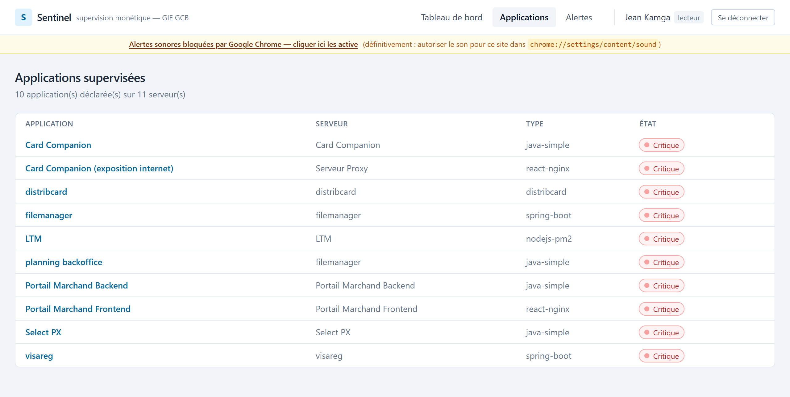{width=16cm}

## Se déconnecter

Bouton **Se déconnecter**, en haut à droite. Votre session expire par ailleurs seule au bout de
douze heures.

---

# Le tableau de bord

C'est la vue d'ensemble : une carte par application, et l'état du parc en un coup d'œil.

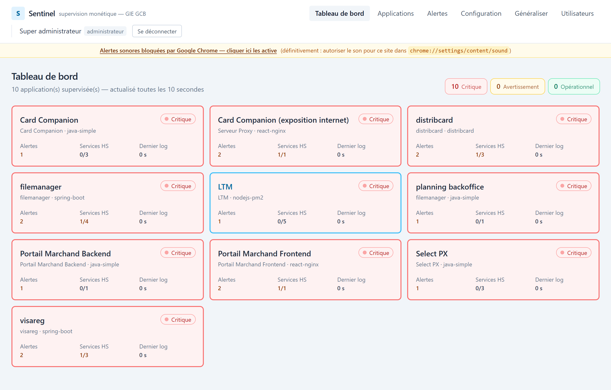{width=16cm}

En haut à droite, trois compteurs résument la situation : combien d'applications sont en état
critique, en avertissement, opérationnelles.

Chaque carte affiche :

- le **nom** de l'application, son serveur et son type ;
- son **état**, par une pastille de couleur ;
- le nombre d'**alertes** actives ;
- les **services HS** sous la forme « 1/4 » — un service arrêté sur quatre surveillés ;
- l'ancienneté du **dernier log** reçu.

| Pastille | Signification |
|:---|:---|
| **Critique** | Une alerte critique est active, ou un service *critique* est tombé |
| **Avertissement** | Des alertes existent, mais aucune n'est critique |
| **Opérationnel** | Rien à signaler |

Un détail à connaître : un service **non critique** qui tombe déclenche bien une alerte, mais ne
fait pas passer la carte au rouge. Sans cette distinction, un service accessoire ferait rougir une
application par ailleurs saine — et le rouge finirait par ne plus être lu.

La page se rafraîchit toute seule toutes les dix secondes. Cliquez sur une carte pour ouvrir
l'application.

---

# Suivre une application

L'écran **Applications** liste tout le parc. Cliquez sur un nom pour l'ouvrir.

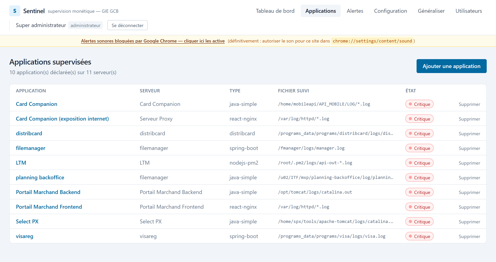{width=16cm}

## Les logs en temps réel

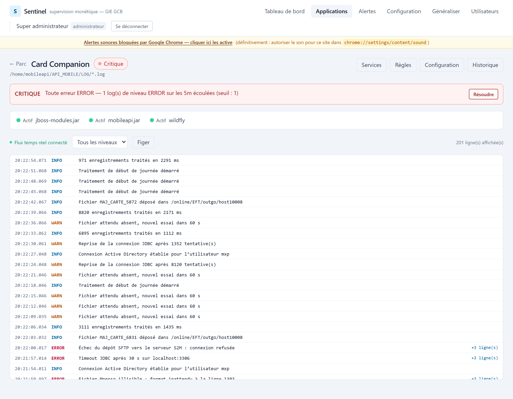{width=16cm}

Les lignes arrivent au fil de l'eau, les plus récentes en haut. Les couleurs par niveau (`ERROR`,
`WARN`, `INFO`…) sont configurables par application.

Trois commandes utiles :

- **filtrer par niveau** pour ne garder que les erreurs ;
- **Figer** le défilement, le temps de lire une ligne — les lignes continuent d'arriver et
  s'afficheront à la reprise ;
- **cliquer sur une ligne** pour la déplier et voir la ligne brute d'origine, telle qu'écrite par
  l'application avant analyse.

Le viewer conserve les deux mille dernières lignes. Au-delà, passez par la recherche historique :
un flux temps réel est illimité par nature, et sans plafond l'onglet finirait par devenir
inutilisable — précisément au moment où vous en auriez besoin.

## Rechercher dans l'historique

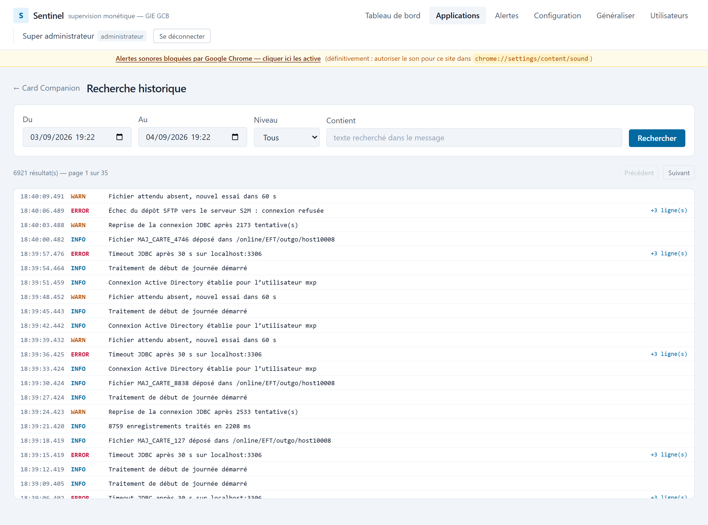{width=16cm}

Choisissez une plage de dates, éventuellement un niveau et un texte à chercher. C'est l'écran à
utiliser pour instruire un incident passé : « qu'est-ce qui s'est passé hier entre 14h et 15h ».

> **Les horodatages sont ceux du serveur d'origine**, convertis pour l'affichage. Une ligne écrite
> à 14h03 sur le serveur applicatif s'affiche à 14h03, quel que soit le fuseau de votre poste.

## Les services surveillés

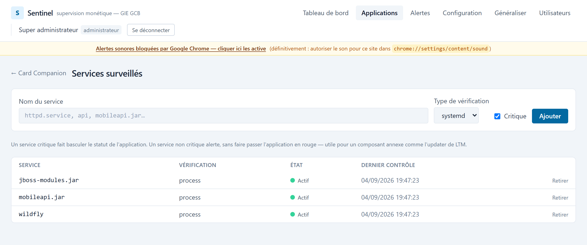{width=16cm}

Un service arrêté n'écrit aucune ligne de log : il disparaît, simplement. C'est pourquoi son état
est suivi séparément des logs.

Chaque service affiche son état courant et l'heure de la dernière vérification. Un service marqué
**critique** fait basculer l'état de l'application ; les autres alertent sans faire rougir la carte.

Un état « inconnu » qui dure signale généralement que l'agent ne remonte plus ses vérifications —
pas que le service va bien.

---

# Les alertes

## Consulter

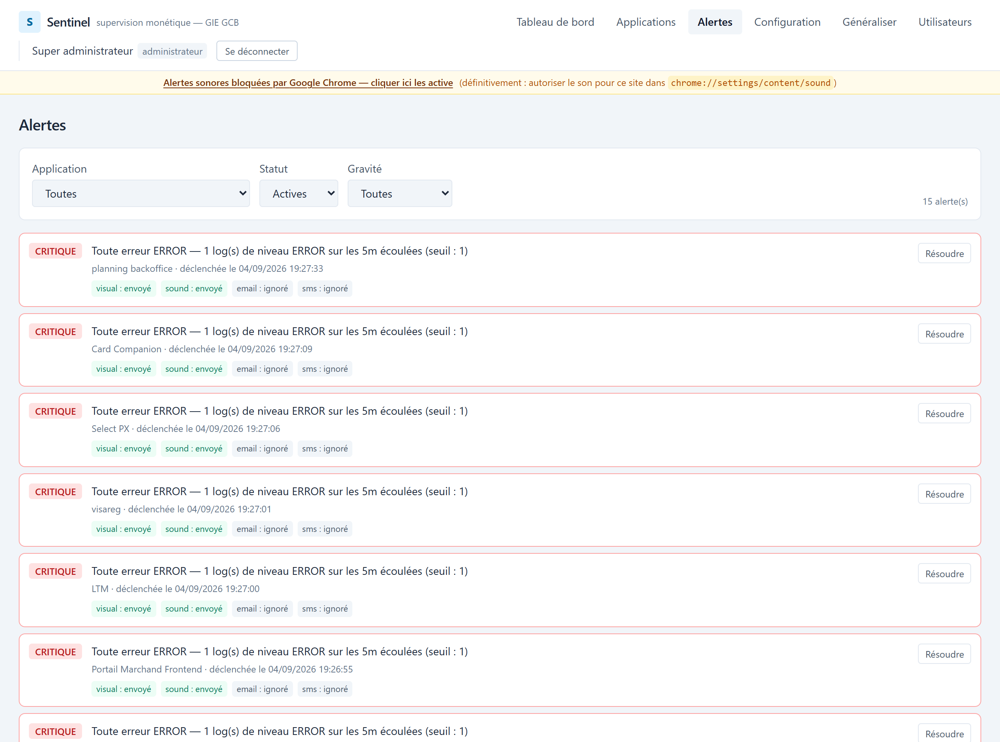{width=16cm}

L'écran **Alertes** liste tout ce qui s'est déclenché, filtrable par application, par gravité et
par état (actives ou résolues).

Chaque alerte indique l'application concernée, la règle qui l'a déclenchée, son message, son heure
de déclenchement, et les canaux sur lesquels elle a été notifiée.

## Résoudre — superviseurs et administrateurs

Le bouton **Résoudre** marque l'alerte comme traitée. Elle sort des compteurs et de la vue
« actives », mais reste consultable.

**Rien ne se résout tout seul.** Une alerte qui disparaîtrait d'elle-même laisserait croire que le
problème a été traité. Résoudre est un geste explicite, qui engage : il signifie « j'ai regardé ».

Le bon réflexe est donc de traiter la cause d'abord, puis de résoudre — et non l'inverse.

## Le son

Sur l'écran de l'open space, une alerte critique déclenche une **sirène** de plusieurs secondes,
conçue pour attirer l'attention à travers un plateau. Elle ne se déclenche que pour les
applications dont le canal « son » est activé.

Un bandeau jaune peut apparaître en haut de l'écran :

> *Alertes sonores bloquées par le navigateur — cliquer ici les active*

Les navigateurs interdisent à une page de jouer un son avant la première interaction de
l'utilisateur. Un clic n'importe où lève le blocage pour la session. Pour l'écran mural, où
personne ne clique, autorisez le son pour le site une fois pour toutes dans les paramètres du
navigateur — le bandeau indique le chemin exact à ouvrir.

---

# Protéger son compte

L'écran **Mon compte** s'ouvre en cliquant sur votre nom, en haut à droite.

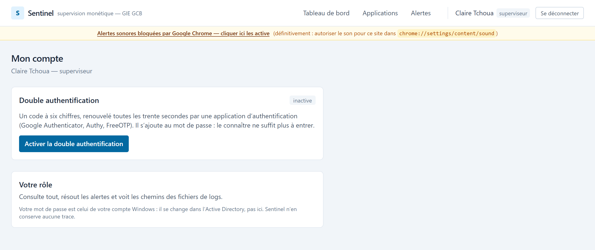{width=15cm}

Votre mot de passe est celui de votre compte Windows : il se change dans l'Active Directory, pas
ici. Sentinel n'en conserve aucune trace.

## La double authentification

Un code à six chiffres, renouvelé toutes les trente secondes par une application d'authentification
— Google Authenticator, Authy, FreeOTP. Il s'ajoute au mot de passe : le connaître ne suffit plus
à entrer.

### L'activer

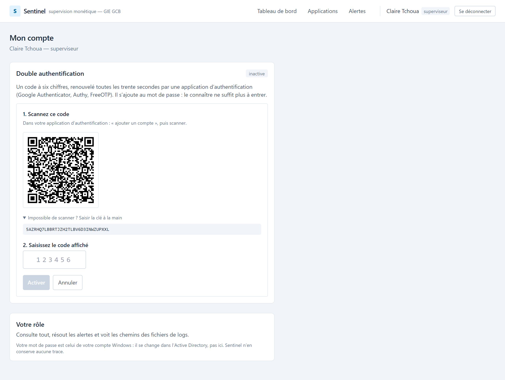{width=15cm}

1. Cliquez sur **Activer la double authentification** ;
2. dans votre application d'authentification, choisissez « ajouter un compte », puis scannez le QR
   code affiché ;
3. saisissez le code à six chiffres que l'application affiche, et validez.

Tant que cette troisième étape n'est pas faite, **rien n'est activé**. C'est volontaire : si le QR
avait été mal scanné, vous vous retrouveriez enfermé dehors à votre prochaine connexion sans avoir
rien fait de mal.

> Si vous ne pouvez pas scanner — écran trop petit, appareil photo indisponible — dépliez
> « Impossible de scanner ? » et recopiez la clé à la main dans votre application.

### Les codes de récupération

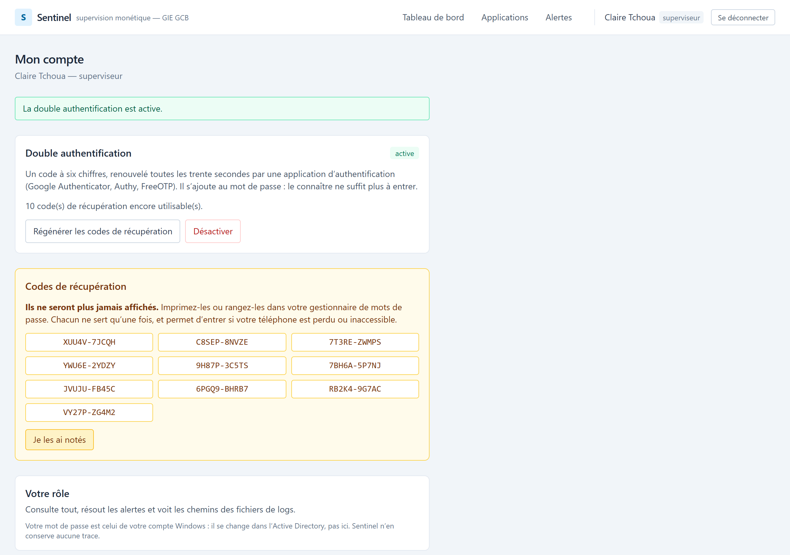{width=15cm}

L'activation affiche **dix codes de récupération**. Ils ne seront **plus jamais affichés**.

Imprimez-les, ou rangez-les dans votre gestionnaire de mots de passe. Chacun ne sert qu'une fois, et
permet d'entrer si votre téléphone est perdu, cassé ou simplement resté chez vous. Saisissez-en un
dans le champ du code, à la place des six chiffres.

Quand il vous en reste peu, régénérez-en depuis cet écran. Les précédents cessent alors de
fonctionner.

### Si vous perdez votre téléphone

Utilisez un code de récupération pour entrer, puis reconfigurez la double authentification sur votre
nouvel appareil.

Si vous n'avez plus ni téléphone ni codes, un administrateur peut réinitialiser votre double
authentification. Vous vous reconnecterez alors avec votre seul mot de passe, et pourrez la
reconfigurer.

### Un code toujours refusé ?

Presque toujours l'**horloge du téléphone**. Ces codes dépendent de l'heure : une minute d'écart
suffit à les rendre invalides. Activez le réglage automatique de la date et de l'heure sur votre
téléphone.

---

# Guide de l'administrateur

## Déclarer une application

**Applications → Ajouter une application.** Renseignez le nom, le type, le serveur et le chemin du
fichier de logs à suivre.

Le **type** détermine comment les lignes seront analysées. Types disponibles :

| Type | Pour |
|:---|:---|
| `spring-boot` | Applications Spring Boot |
| `java-simple` | Applications Java au format de log simple |
| `nodejs-pm2` | Applications Node lancées par PM2 |
| `react-nginx` | Frontaux React servis par Nginx |
| `distribcard` | Le format propre à distribcard |

Si aucun ne correspond, choisissez le plus proche : un parseur générique prend le relais et remonte
les lignes avec un niveau déduit au mieux. Mieux vaut une supervision approximative qu'une
application invisible.

À la validation, Sentinel affiche un **token d'agent** et la commande d'installation.

> **Ce token n'est affiché qu'une seule fois.** La base n'en conserve que l'empreinte. Copiez-le
> avant de fermer le panneau. En cas d'oubli, ce n'est pas grave : émettez-en un nouveau depuis la
> même page. Les anciens restent valides tant qu'ils ne sont pas révoqués, ce qui permet de
> remplacer un agent sans interruption.

L'installation de l'agent sur le serveur applicatif est décrite dans le *Guide de déploiement*,
section 10.

## Surveiller des services

**Application → Services → Ajouter un service.** Saisissez le nom exact de l'unité systemd, tel que
le donne `systemctl list-units --type=service` sur le serveur.

Cochez **critique** si l'indisponibilité de ce service rend l'application inutilisable. C'est cette
case qui décide si la carte du tableau de bord passe au rouge.

Ajouter un service crée **automatiquement deux règles** : une qui alerte s'il s'arrête, une qui
alerte si l'agent cesse d'en donner des nouvelles. La seconde est indispensable — sans elle, un
agent muet laisserait le service affiché dans son dernier état connu, vert le plus souvent, alors
que plus personne ne le surveille.

## Régler les règles d'alerte

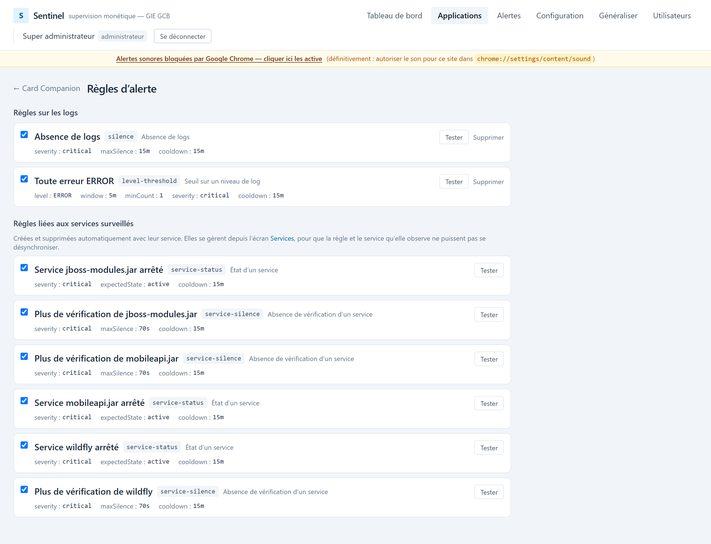{width=16cm}

L'écran distingue deux familles :

**Les règles sur les logs**, que vous créez et supprimez :

| Type | Se déclenche quand |
|:---|:---|
| `level-threshold` | Un niveau de log apparaît trop souvent — `ERROR` plus de *n* fois en *m* minutes |
| `pattern-rate` | Un texte donné apparaît trop souvent |
| `silence` | Plus aucun log reçu depuis un délai |

**Les règles liées aux services**, créées et supprimées automatiquement avec leur service. Elles ne
se gèrent pas ici, mais depuis l'écran Services — pour que la règle et le service qu'elle observe
ne puissent pas se désynchroniser.

Chaque règle porte un **cooldown** : après une notification, les redéclenchements sont regroupés
jusqu'à expiration du délai. Sans lui, une application produisant mille erreurs par minute enverrait
mille SMS.

Le bouton **Tester** évalue la règle immédiatement, sur les données réelles, et affiche si elle se
déclencherait. **Aucune alerte n'est créée, personne n'est notifié.** C'est le moyen de valider un
seuil avant de l'activer.

La case à cocher active ou désactive une règle sans la supprimer : utile pour faire taire
temporairement une alerte connue, pendant une maintenance.

## Configurer une application

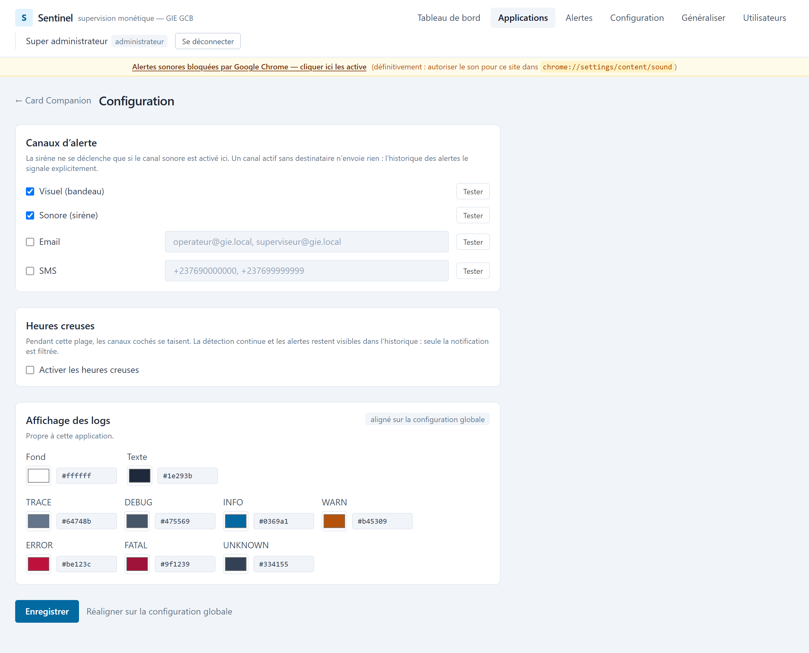{width=16cm}

Deux réglages :

**Les couleurs par niveau de log**, qui n'affectent que l'affichage.

**Les canaux d'alerte** — visuel, son, courriel, SMS — activables indépendamment, avec leurs
destinataires. Le bouton **Tester** de chaque canal envoie une vraie notification : c'est la façon
de vérifier que le SMTP ou la passerelle SMS fonctionnent, sans attendre un incident.

Vous pouvez aussi définir des **heures creuses** : une plage horaire pendant laquelle certains
canaux sont suspendus. Une alerte survenue à trois heures du matin reste enregistrée et visible sur
le tableau de bord — elle n'est simplement pas envoyée par SMS.

## Configuration globale et généralisation

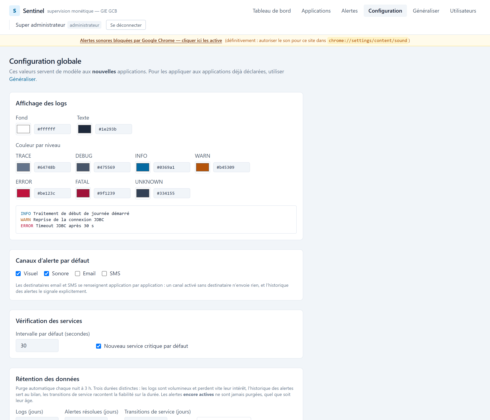{width=16cm}

La configuration globale sert de **modèle aux nouvelles applications**. La modifier ne change rien
aux applications existantes.

Ce n'est pas un oubli, c'est un choix : une modification du réglage global ne doit pas changer
silencieusement l'affichage d'applications qu'on ne touchait pas.

Pour appliquer la configuration globale à des applications déjà déclarées, passez par
**Généraliser** :

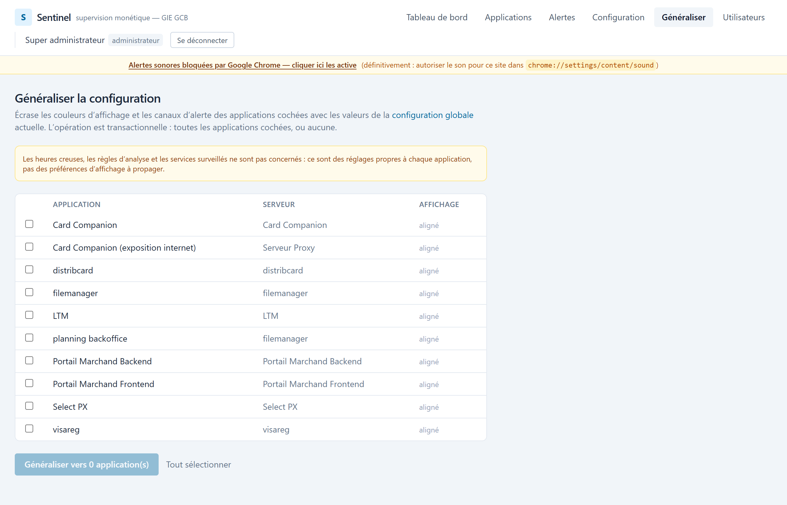{width=16cm}

Choisissez les applications concernées, et la configuration globale y est **recopiée**. L'opération
écrase leurs réglages propres : c'est explicite et volontaire.

## Gérer les utilisateurs

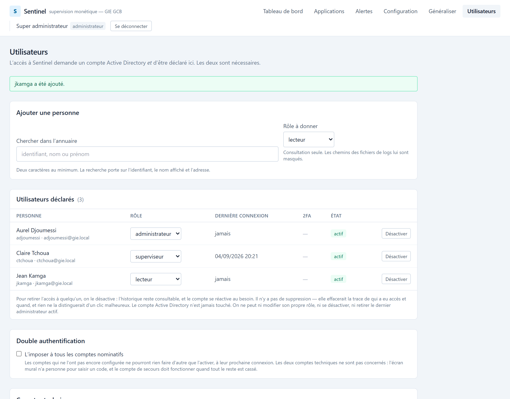{width=16cm}

### Ajouter une personne

Une personne n'est **jamais saisie à la main** : on la cherche dans l'annuaire, et on la choisit.

1. Tapez un fragment de nom, de prénom ou d'identifiant — deux caractères minimum ;
2. la recherche affiche les personnes correspondantes, en signalant celles déjà déclarées ;
3. choisissez le rôle à donner, puis cliquez sur **Ajouter**.

Ce détour par l'annuaire garantit que l'identifiant enregistré correspond exactement à un compte
existant. Saisi à la main, la moindre faute de frappe produirait un compte incapable de se
connecter, et dont personne ne comprendrait pourquoi.

### Choisir le rôle

| Rôle | Pour qui |
|:---|:---|
| **lecteur** | L'écran de l'open space, et toute personne qui consulte sans agir |
| **superviseur** | L'exploitation : consulte tout, acquitte les alertes, voit les chemins des fichiers |
| **administrateur** | Ceux qui configurent applications, règles et utilisateurs |

Le rôle se change à tout moment depuis la liste déroulante, et prend effet immédiatement — y
compris pour une personne déjà connectée.

### Retirer l'accès

Le bouton **Désactiver** coupe l'accès. Le compte reste dans la liste, son historique reste
consultable, et un clic suffit à le réactiver.

**Il n'y a pas de suppression.** Elle effacerait la trace de qui a eu accès et quand — précisément
ce qu'on veut pouvoir consulter après un incident — et rien ne la distinguerait d'un clic
malheureux.

Le compte Active Directory n'est jamais touché : désactiver quelqu'un dans Sentinel ne change rien
à son compte Windows.

### Garde-fous

Vous ne pouvez ni modifier votre propre rôle, ni vous désactiver, ni retirer le dernier
administrateur actif. Ces refus évitent de se retrouver enfermé dehors.

### La double authentification

La colonne **2FA** indique qui l'a activée. Cliquer sur « active » la **réinitialise** — c'est le
geste à faire pour quelqu'un qui a perdu son téléphone et n'a plus ses codes de récupération. La
personne se reconnectera avec son seul mot de passe, et pourra la reconfigurer.

Vous ne pouvez pas l'activer à la place de quelqu'un : l'appairage suppose de scanner un QR code
avec son propre téléphone.

La case **L'imposer à tous les comptes nominatifs** la rend obligatoire. Attention à ce qu'elle
implique : au moment où vous la cochez, personne ne l'a encore configurée. Les comptes concernés
pourront se connecter, mais leur session ne donnera accès **qu'à l'écran Mon compte**, le temps
qu'ils l'activent. Prévenez avant de cocher.

Les deux comptes techniques ne sont pas concernés : l'écran mural n'a personne pour saisir un code,
et le compte de secours doit fonctionner quand tout le reste est cassé.

### Les deux comptes techniques

`sentineluser` et `sentineladmin` ne figurent pas dans la liste et ne peuvent pas y être ajoutés :
ils sont définis par la configuration du serveur et n'existent pas dans l'annuaire.

- **`sentineluser`** — lecteur, pour l'écran de l'open space. Sa session dure trente jours, pour
  que l'affichage ne se déconnecte pas tout seul un matin.
- **`sentineladmin`** — super administrateur. C'est un **filet de sécurité**, pas un compte de
  travail : s'en servir au quotidien revient à partager un mot de passe entre plusieurs personnes,
  ce que la gestion nominative existe précisément pour éviter.

## Rétention des données

**Configuration → Rétention** fixe les durées de conservation : logs, alertes résolues, événements
de service. La purge s'exécute automatiquement, et peut être déclenchée à la main.

Une alerte **active** n'est jamais purgée, quel que soit son âge. Une alerte ouverte depuis
quatre-cents jours signale un problème que personne n'a traité : c'est exactement celle qu'il ne
faut pas perdre.

---

# L'écran de l'open space

Pour l'écran mural, trois réglages une fois pour toutes :

1. connectez-vous avec le compte **`sentineluser`** — sa session de trente jours évite les
   déconnexions inopinées ;
2. **autorisez le son** pour le site dans les paramètres du navigateur, sinon la sirène restera
   muette faute d'interaction ;
3. laissez le **tableau de bord** affiché : il se rafraîchit seul et n'a besoin de personne.

Une alerte critique déclenche la sirène quel que soit l'écran affiché — il n'est pas nécessaire
d'être sur la page des alertes pour l'entendre.

---

# Questions fréquentes

**Mon mot de passe Windows fonctionne, mais Sentinel me refuse.**
Vous n'êtes probablement pas déclaré comme utilisateur. Les deux conditions sont nécessaires :
compte Active Directory *et* déclaration dans Sentinel. Demandez à un administrateur.

**Je ne vois pas le menu « Configuration » que mon collègue a.**
Il est réservé aux administrateurs. Votre rôle est affiché à côté de votre nom, en haut à droite.

**La colonne « Fichier suivi » n'apparaît pas chez moi.**
Elle est masquée aux lecteurs. Ces chemins décrivent l'arborescence de machines de production ;
seuls les superviseurs et administrateurs y ont accès.

**Une application est au rouge mais tout semble fonctionner.**
Ouvrez-la et regardez ses alertes actives. Il s'agit souvent d'une alerte ancienne, jamais résolue :
résolvez-la si le problème est traité. Vérifiez aussi ses services — un service *critique* arrêté
suffit à faire rougir la carte.

**Les logs ne défilent plus.**
Vérifiez d'abord que le défilement n'est pas en pause. Si l'application indique un dernier log
ancien, c'est l'agent du serveur applicatif qui n'émet plus : une alerte « Absence de logs » aura dû
se déclencher.

**Aucun son ne se déclenche.**
Le navigateur bloque la lecture automatique tant que personne n'a interagi avec la page. Cliquez
n'importe où, ou autorisez le son pour le site dans ses paramètres — le bandeau jaune indique le
chemin.

**J'ai perdu le token d'un agent.**
Émettez-en un nouveau depuis la page de l'application. L'ancien reste valide tant qu'il n'est pas
révoqué, l'agent en place continue donc d'émettre pendant le remplacement.

**J'ai supprimé une règle par erreur : ai-je perdu l'historique de ses alertes ?**
Non. Les alertes déjà déclenchées restent dans l'historique ; elles perdent seulement le lien vers
la règle qui les a produites.

**Mon code à six chiffres est toujours refusé.**
L'horloge de votre téléphone est probablement décalée. Ces codes dépendent de l'heure, et une minute
d'écart suffit. Activez le réglage automatique de la date et de l'heure.

**J'ai perdu mon téléphone et mes codes de récupération.**
Demandez à un administrateur de réinitialiser votre double authentification depuis l'écran
Utilisateurs. Vous vous reconnecterez avec votre seul mot de passe.

**Puis-je faire taire une alerte pendant une maintenance ?**
Oui : décochez la règle concernée le temps de l'intervention, puis recochez-la. La règle est
conservée, seule son évaluation est suspendue.
